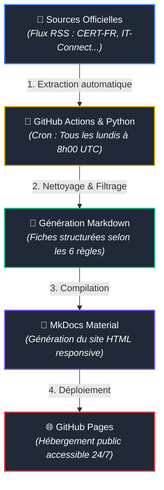

# ⚙️ Fonctionnement du Portail de Veille

Ce portail est une plateforme automatisée de suivi technologique. Il collecte, structure et publie sans intervention humaine les actualités critiques en cybersécurité et en administration système.

---

## 🔄 Le Pipeline d'Automatisation (Architecture)

La collecte et la publication reposent sur une chaîne d'outils 100 % automatisée hébergée sur **GitHub** :



---

## 📡 D'où proviennent les informations ?

| Axe | Source principale | Méthode d'extraction | Type de contenu récupéré |
| --- | --- | --- | --- |
| **Axe 1 (Hebdo)** | **CERT-FR** (*ssi.gouv.fr*) | Flux RSS officiel | Bulletins de sécurité, failles Zero-Day, alertes d'urgence |
| **Axe 2 (Mensuel)** | **IT-Connect** (*it-connect.fr*) | Flux RSS + Filtres Python | Articles sur l'IA, l'AIOps, PowerShell, Python & SysAdmin |
| **Axe 3 (Trimestriel)** | **Rapports d'éditeurs** | Analyse synthétique manuelle | Rapports de tendance (CrowdStrike, Trend Micro, ANSSI) |

---

## 🛠️ Que fait le script Python (`fetch_news.py`) ?

À chaque exécution, le script effectue 5 opérations automatisées :

1. **Requête HTTP :** Connexion aux serveurs distants pour télécharger les flux XML/RSS.
2. **Filtrage par mots-clés :** Pour l'Axe 2, sélection stricte des articles liés à l'IA, aux scripts et à l'automatisation.
3. **Nettoyage HTML :** Suppression du code superflus, des pubs et mise en forme de texte propre.
4. **Enrichissement visuel :** Extraction automatique de l'image de couverture ou affectation d'un badge de gravité (🔴 Critique / 🟠 Élevé).
5. **Génération structurée :** Mise en page sous la grille de contrôle des **6 règles** (Source, Gravité, Résumé, Impact, Action, Lien).

---

## 📋 La Grille de Contrôle des 6 Règles

Chaque fiche publiée respecte scrupuleusement le schéma suivant :

1. **Source & Date :** Origine vérifiée et traçabilité temporelle.
2. **Niveau de Gravité / Thématique :** Classification visuelle directe.
3. **Résumé analytique :** Synthèse débarrassée du superflu marketing.
4. **Impact & Périmètre :** Systèmes affectés et risques pour l'infrastructure.
5. **Action recommandée :** Correctif, patch ou recommandation d'usage.
6. **Lien officiel :** Accès direct à la publication d'origine.

```

```
